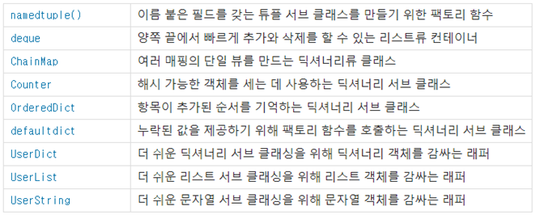

## 문제를 통해 알게된 개념

---

## Best 우수풀의
``` python
import collections

def solution(participant, completion):
    answer = collections.Counter(participant) - collections.Counter(completion)
    return list(answer.keys())[0]
``` 
---
## 우수풀의 해석

### collections.Counter()
해시 가능한 객체를 세는 데 사용하는 딕셔너리 서브 클래스



---

## 다른 우수풀의
``` python
def solution(participant, completion):
    answer = ''
    temp = 0
    dic = {}
    for part in participant:
        dic[hash(part)] = part
        temp += int(hash(part))
    for com in completion:
        temp -= hash(com)
    answer = dic[temp]

    return answer
```

