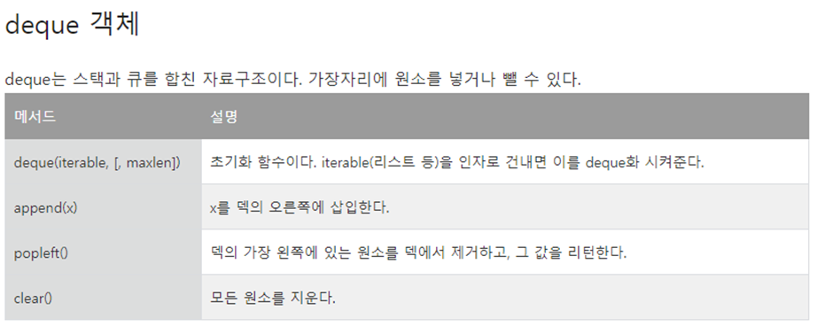

## 문제를 통해 알게된 개념
deque는 스택과 큐를 합친 자료구조이다.

---

## Best 우수풀의
``` python
from collections import deque
def solution(prices):
    answer = []
    prices = deque(prices)
    while prices:
        c = prices.popleft()

        count = 0
        for i in prices:
            if c > i:
                count += 1
                break
            count += 1

        answer.append(count)

    return answer
``` 
---
## 우수풀의 해석

### popleft()
popleft() : 덱의 가장 왼쪽에 있는 원소를 덱에서 제거하고, 그 값을 리턴한다.



---

## 다른 우수풀의
``` python
def solution(prices):
    answer = [0] * len(prices)
    for i in range(len(prices)):
        for j in range(i+1, len(prices)):
            if prices[i] <= prices[j]:
                answer[i] += 1
            else:
                answer[i] += 1
                break
    return answer
```

